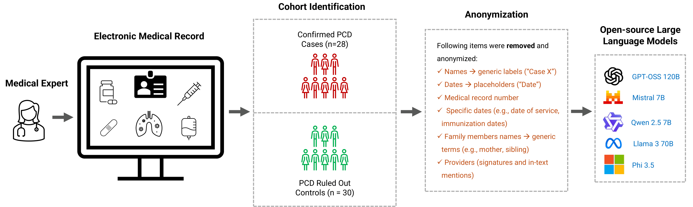

<h1 align="center"> Large Language Models for Primary Ciliary Dyskinesia (PCD)</a></h1>
<h5 align="center"> If you like our project, please give us a star ⭐ on GitHub for the latest update.</h5>
<h5 align="center">

<p align="center">
  
</p>
<p align="center"><b>Figure 1: Experimental Task Design.</b></p>


### 📑 Citation
Please consider citing 📑 our paper if our repository is helpful to your work.
```bibtex
@inproceedings{rajwal-etal-2026-diagnostic,
title = "Diagnostic Reasoning with Large Language Models for a Rare Disease: Case Study of Primary Ciliary Dyskinesia",
author = "Rajwal, Swati
and Fain, Mary Ellen
and Guglani, Lokesh
and Sarker, Abeed",
year = "2026",
url = "https://aclanthology.org/2026.cl4health-1",
}
```

### License
<a href="https://opensource.org/licenses/MIT">
  
</a>
<br />
This work is licensed under the 
<a href="https://opensource.org/licenses/MIT">MIT License</a>.
